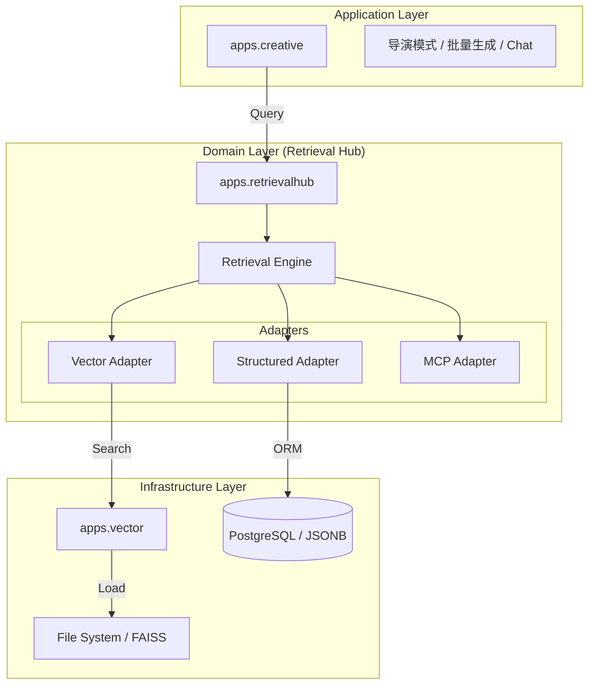

# VSS Edge RAG 架构重构设计方案

## 1. 背景与痛点

当前 VSS Edge 的 RAG (Retrieval-Augmented Generation) 实现存在结构性失衡：
1.  **Inference 定位模糊**: `apps.workflow.inference` 混合了底层向量技术（Infrastructure）和业务检索逻辑（Domain），且作为 Workflow 的子环节，生命周期被强绑定在人工任务流中。
2.  **数据源孤岛**: 结构化数据（Annotation JSON）、向量索引（FAISS）、外部知识（MCP）缺乏统一的调度层，下游消费者需要分别对接。
3.  **Creative 扩展受限**: `apps.workflow.creative` 耦合在 Workflow 中，难以演进为独立的创作应用（如 Chatbot、实时编辑器）。

## 2. 重构目标

通过 **分层架构 (Layered Architecture)** 实现关注点分离：
*   **Infrastructure Layer**: 剥离纯技术能力的向量引擎 (`apps.vector`)。
*   **Domain Layer**: 建立统一的检索中枢 (`apps.retrievalhub`)，屏蔽数据源差异。
*   **Application Layer**: 将创作能力独立为顶层应用 (`apps.creative`)。

## 3. 目标架构视图

## 4. 详细设计

### 4.1 `apps.vector` (Infrastructure)
**定位**: 纯粹的向量计算与存储基建，无业务状态。
*   **职责**:
    *   **Embedding**: 封装 `SentenceTransformer`，提供文本转向量能力。
    *   **Index Management**: 封装 `FAISS`，提供索引的构建 (Build)、保存 (Save)、加载 (Load)。
    *   **Raw Search**: 提供基于向量的 Top-K 检索。
*   **关键原则**: 不引用 `AnnotationJob` 等业务模型，只接受 `List[str]` 或 `List[Vector]` 等基础数据类型。

### 4.2 `apps.retrievalhub` (Domain)
**定位**: 业务检索中台，负责“找数据”。
*   **核心组件**:
    *   **Adapters (适配器模式)**:
        *   `StructuredAdapter`: 对接 `AnnotationJob` 的 JSON 产出 (Dialogues, Scenes)，支持精确字段过滤。
        *   `VectorAdapter`: 调用 `apps.vector`，负责将自然语言转为向量，检索 FAISS，并解析元数据。
        *   `MCPAdapter`: (规划中) 对接 Model Context Protocol 外部服务。
    *   **RetrievalEngine (外观模式)**:
        *   提供统一接口 `search(query: str, context: Dict)`。
        *   实现路由策略（Router）：决定查哪些源。
        *   实现融合策略（Merger）：合并结构化匹配与语义匹配的结果。

### 4.3 `apps.creative` (Application)
**定位**: 消费者应用。
*   **变更**:
    *   从 `apps.workflow.creative` 迁移至 `apps.creative`。
    *   删除对 `inference` 模块的直接依赖。
    *   通过 `apps.retrievalhub` 获取创作所需的上下文信息。

## 5. 迁移路径

### Step 1: 建立 `apps.vector`
1.  创建 `apps/vector` 包结构。
2.  迁移 `modeling/services/vectorizer.py` -> `apps/vector/services/embedding.py`。
3.  迁移 `modeling/services/builder.py` (部分逻辑) -> `apps/vector/services/storage.py`。

### Step 2: 建立 `apps.retrievalhub`
1.  创建 `apps/retrievalhub` 包结构。
2.  定义 `BaseAdapter` 接口。
3.  实现 `StructuredAdapter` (读取 Annotation DB)。
4.  实现 `VectorAdapter` (调用 `apps.vector`)。
5.  实现 `RetrievalEngine`。

### Step 3: 重构 `apps.creative`
1.  将 `apps/workflow/creative` 移动到 `apps/creative`。
2.  修正 `models.py` 引用。
3.  重构 `tasks.py` 中的数据获取逻辑，改为调用 `RetrievalEngine`。

### Step 4: 清理
1.  删除 `apps/workflow/inference`。
2.  删除 `apps/workflow/modeling` (如果还残留)。