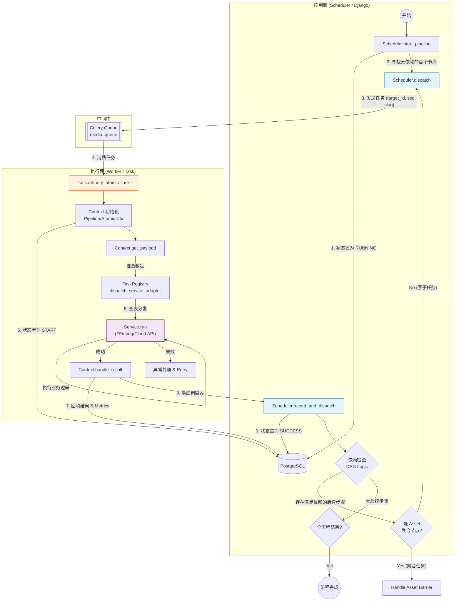

# Refinery Atomflow Architecture

本文档描述了 Refinery 子系统的核心工作流架构。采用 **自驱动 (Self-Driving / Choreography)** 模式：Scheduler 负责发令与决策，Task 负责执行并驱动下一跳。

## 核心工作流图

## 关键组件职责

1.  **Scheduler (`scheduler.py`)**: 无状态的决策大脑。
    *   负责计算 DAG 依赖。
    *   负责处理 Barrier 同步。
    *   不直接依赖具体的 Service 实现。

2.  **Task (`tasks.py`)**: 通用的执行容器。
    *   负责 Context 的生命周期管理。
    *   通过 `task_registry` 将抽象的 `slug` 映射为具体的代码执行。
    *   执行完成后，主动调用 Scheduler 进行状态流转。