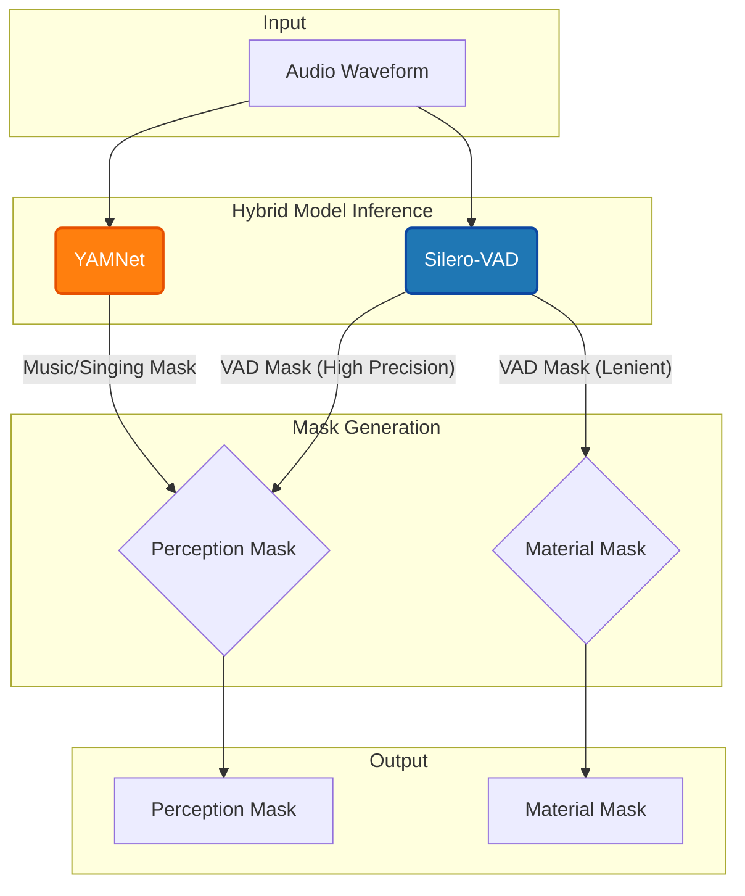

# 语义门控服务 (Audio Gating Service) 设计文档

## 1. 概述 (Overview)

`AudioGatingService` 是一个核心的音频处理服务，其唯一目标是 **从一段音频中精准地识别并提取出有效的人类语音（Speech）部分**。它通过先进的 AI 模型，不仅能检测声音的有无，更能从语义上区分“说话”与“唱歌”、“音乐”、“噪音”等非语音内容。

该服务是配音（Dubbing）流程中至关重要的预处理步骤。它输出的“语音掩码（Mask）”为下游的 **ASR（语音识别）** 和 **TTS（语音合成）** 等任务提供了干净、准确的输入，其质量直接决定了最终配音的效果。

### 1.1. 核心功能

- **语音/非语音分离**：在时间轴上以采样点级别的精度标记出哪些片段是有效的人声对白。
- **语义过滤**：利用音频事件分类模型，智能剔除人声中的歌唱、哼唱部分，以及背景中的音乐和噪音。
- **双重掩码输出**：生成两种不同用途的掩码（`perception` 和 `material`），以服务于不同的下游任务。

## 2. 核心算法设计

算法的核心思想是 **“VAD定边界，YAMNet定语义”** 的混合模型策略，以一种互补的方式，兼顾了时间精度和语义准确性。



### 2.1. 混合模型策略 (Hybrid Model Strategy)

1.  **Silero-VAD (Voice Activity Detection)**:
    -   **角色**: **时间精度引擎**。
    -   **优势**: 轻量、快速，能提供毫秒级的语音活动起止点检测。在 `_run_vad` 方法中实现。
    -   **局限**: 无法区分说话、唱歌和带人声的音乐。它只知道“这里有声音”，但不知道“这是什么声音”。

2.  **YAMNet (Audio Event Classifier)**:
    -   **角色**: **语义理解引擎**。
    -   **优势**: 能识别521种音频事件，可以明确区分 `Speech` 和 `Music`, `Singing` 等类别。
    -   **局限**: 时间分辨率较低（帧长约0.48秒），边界检测不精确。

通过融合两者的优势，系统能够在 VAD 提供的高精度时间边界内，利用 YAMNet 进行语义判断，从而实现精准且语义正确的语音提取。

### 2.2. 掩码生成逻辑 (Mask Generation Logic)

服务生成两种核心掩码，以满足不同场景的需求：

#### A. 感知掩码 (Perception Mask)

- **用途**: 用于 ASR 识别、TTS 对齐等需要纯净对话语音的场景。
- **目标**: 最大化保留“说话”内容，同时过滤掉所有音乐、歌唱和噪音。
- **核心公式**:
  ```python
  # 伪代码
  mask_perception = vad_mask_perception * (1.0 - yamnet_music_tensor.squeeze())
  ```
- **生成步骤**:
    1.  **VAD 初筛**: 使用 Silero-VAD (阈值 `0.20`) 生成一个高精度的基础语音活动掩码 `vad_mask_perception`。
    2.  **YAMNet 语义过滤**:
        - 遍历 YAMNet 输出的每一帧分数。
        - 根据预设的 `keep_categories` 和 `reject_categories`，判断每一帧是否为音乐或歌唱。
        - 特别地，当检测到强烈的音乐信号 (`max_music_score > 0.30`) 时，会强制将该片段标记为音乐，即使它也包含一些语音特征。
        - 生成一个与原始音频等长的 `yamnet_music_vec` 向量。
    3.  **掩码相减 (核心)**: 从 VAD 圈定的语音区域中，“减去”YAMNet 标记出的音乐区域。这意味着，**即使VAD认为是语音，但如果YAMNet认为是音乐，该片段也会被剔除**。
    4.  **形态学处理**:
        - **膨胀 (Dilation)**: 使用 `max_pool1d` (核大小 `4801`) 对 VAD 掩码进行膨胀，以连接被微小静音隔断的语音片段。
        - **平滑 (Smoothing)**: 使用 `avg_pool1d` (`_smooth_mask` 方法) 对最终的掩码进行平滑，使掩码的边界从 0 到 1 的过渡更加自然，避免突变。

#### B. 素材掩码 (Material Mask)

- **用途**: 用于识别纯背景音/静音区域，可服务于背景音补全（Inpainting）或提取纯净背景声（BGM）等任务。
- **目标**: 标记出音频中所有**非静音**的部分，然后反转。
- **核心公式**:
  ```python
  # 伪代码
  mask_material = 1.0 - smooth(dilate(vad_mask_lenient))
  ```
- **生成步骤**:
    1.  **VAD 宽泛检测**: 使用 Silero-VAD (更宽松的阈值 `0.15`) 生成一个能捕获所有微弱人声的掩码 `vad_mask_material_vec`。
    2.  **大幅膨胀**: 使用一个非常大的卷积核 (`16001` samples, 约1秒) 对掩码进行 `max_pool1d` 膨胀。此举旨在将音频中所有分散的语音活动（无论多短）连接成一个或几个大的连续块。
    3.  **平滑与反转**: 对膨胀后的掩码进行平滑处理，然后用 `1.0` 减去它。最终结果是，值为 `1.0` 的区域代表纯背景/静音，值为 `0.0` 的区域代表存在语音素材。

## 3. 数据流与工程实现

### 3.1. 数据流

1.  **输入**:
    - `vocals_path`: `str`，指向待处理音频文件的绝对路径。
    - `output_base`: `Path`，指向用于存放输出结果的目录。

2.  **内部处理**:
    - 音频通过 `librosa` 加载为 16kHz 单声道，并进行幅度归一化 (`wav / max(abs(wav))`)，以增强模型鲁棒性。
    - `numpy` 数组被转换为 `torch.Tensor`，并移动到 `cuda` 设备上，以利用 GPU 进行后续的 `max_pool1d` 和 `avg_pool1d` 等运算。
    - 模型推理（VAD 和 YAMNet）均通过 `ONNX Runtime` 执行。

3.  **输出**:
    - **函数返回值**: 一个字典 `{"mask_path": str, "logs": list}`。
    - **磁盘文件**: 在 `output_base` 目录下生成 `gating_masks.pt` 文件。
        - **格式**: PyTorch Tensor 序列化文件。
        - **内容**: 一个字典，包含 `"perception"`, `"material"` 等键，值为对应的 `torch.Tensor` 掩码。
        - **选择 `.pt` 的原因**: 相比 JSON/CSV，`.pt` 格式能无损、高效地存储高维浮点数张量，便于下游的 PyTorch 算子直接加载使用，避免了序列化/反序列化的性能开销和精度损失。

### 3.2. 工程化考量

- **性能优化 (Performance)**:
  - 使用 `ONNX Runtime` 并优先选择 `CUDAExecutionProvider`，以获得最佳推理性能。
  - 所有的掩码后处理（膨胀、平滑）都在 GPU 上使用 PyTorch 的 `nn.functional` 函数完成，效率远高于在 CPU 上使用 `numpy` 操作。

- **资源管理 (Resource Management)**:
  - 在 `AudioGatingService.run` 方法的 `finally` 块中（建议），通过 `del gater` 和 `utils.cleanup_gpu()` 显式释放 `SemanticGatingHelper` 对象并清理 GPU 显存。这对于在长时运行的流水线中防止显存泄漏或OOM（Out of Memory）至关重要。

- **鲁棒性 (Robustness)**:
  - **音频归一化**: 确保模型对不同录音音量的输入具有一致的响应。
  - **VAD 状态机**: `_run_vad` 方法内部实现了一个小型状态机（`triggered`, `temp_end`），并结合 `min_speech_duration_ms` 和 `min_silence_duration_ms` 参数，能有效避免将短暂的噪音（如咳嗽、咂嘴）误判为语音，并能正确合并被短暂静音分割的同一句话。
  - **边界处理**: 在进行 `max_pool1d` 和 `avg_pool1d` 时，使用了 `padding` 来处理边界效应，并最终将张量裁剪回原始音频长度 `[..., :len(wav)]`，确保掩码与音频精确对齐。

- **可配置性 (Configuration)**:
  - **模型路径**: 所有模型路径均通过 `constants.py` 模块进行统一管理，这些常量又可由环境变量覆盖，提供了良好的部署灵活性。
  - **硬编码参数**: 算法中的多个关键阈值（如 VAD 的 `threshold`，YAMNet 的 `max_music_score > 0.30`，以及各种 `kernel_size`）目前是硬编码的。在未来的迭代中，可以将它们作为可选参数暴露给 `run` 方法，以提高算子对不同音频源的适应性。