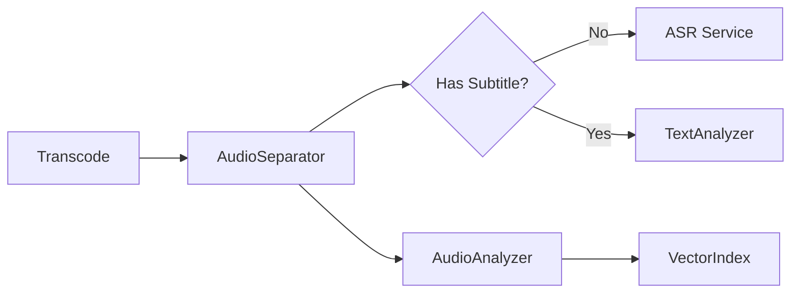

# Change Request: Refinery 音频处理架构演进 (Audio Architecture Evolution)

## 1. 背景与现状

目前的音频处理流程较为线性且耦合：
*   `Transcode`: 负责压制 AAC 音频。
*   `Probe`: 负责提取波形 (Waveform)。
*   `AudioAnalyze`: 负责基于混合轨道 (Mix) 提取声学特征 (Pitch/Speed/Energy)。

**现状局限性**：
*   无法处理背景音乐干扰，导致人声分析不准。
*   缺乏 ASR 能力，强依赖用户上传字幕。
*   波形与特征提取逻辑分散。

## 2. 未来需求 (Future Requirements)

根据业务规划，Refinery 需要引入深度音频处理能力：

1.  **人声分离 (Source Separation)**
    *   引入 **Demucs** (或类似 SOTA 模型)。
    *   输入：Proxy Audio (Mix)。
    *   输出：Vocal Track (人声轨) + Background Track (背景/伴奏轨)。

2.  **多轨声纹与特征分析**
    *   **声纹提取 (Voiceprint)**: 需决策是对 Mix、Vocal 还是 Background 进行提取，或分别提取以构建更丰富的向量索引。
    *   **特征分析 (Librosa)**: 针对 Vocal 轨分析语速、音高、性别；针对 Background 轨分析情绪、BGM 类型。

3.  **ASR 字幕生成 (Automatic Speech Recognition)**
    *   场景：当用户未提供 SRT/VTT 字幕时。
    *   输入：Vocal Track (分离后的人声轨效果更佳)。
    *   输出：带时间轴的文本，并自动对齐到 `Material.dialogues` 结构。

## 3. 建议架构 (Proposed Architecture)

建议在未来重构时，将音频处理独立为一个并行的 **Audio Sub-pipeline**。

### 3.1 新增算子

*   **`AudioSeparatorService` (Demucs)**
    *   **Input**: `proxy.mp4`
    *   **Output**: `vocal.wav`, `background.wav` (存储于 `media_root/refinery/<uuid>/audio/`)

*   **`ASRService` (Whisper / FunASR)**
    *   **Input**: `vocal.wav`
    *   **Output**: `Material.dialogues` (填充 content, start, end)
    *   **Trigger**: 仅在 `source_subtitle` 为空时触发。

### 3.2 改造算子

*   **`ProberService`**
    *   **变更**: 剥离波形计算逻辑，仅保留极速的 `ffprobe` 元数据读取。
    *   **定位**: 回归轻量级元数据探测。

*   **`AudioAnalyzerService`**
    *   **变更**: 
        1. 接收 `vocal.wav` 而非视频文件，提高分析准确度。
        2. 集成波形计算逻辑 (Waveform)，生成更精细的 `vocal_waveform` 和 `bg_waveform`。

### 3.3 推荐流程图

