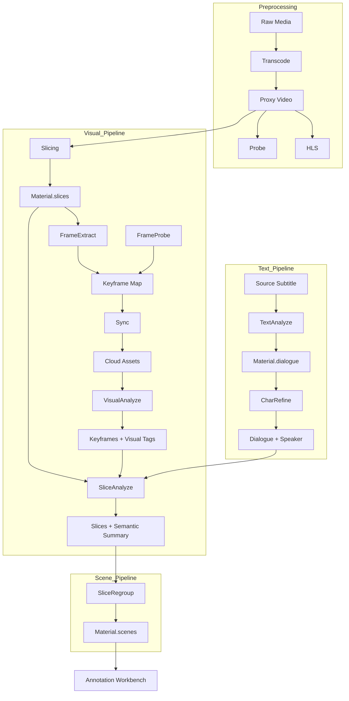

# Refinery Pipeline 架构全景文档

## 1. 系统定位与核心职责

**Refinery** 是 Atomflow 框架下的多模态数据精炼子系统。它的核心职责是将非结构化的原始媒体（Raw Media）转化为结构化、语义化的 **精炼物料 (Material)**。

Refinery 采用 **DAG (有向无环图)** 编排模式，通过一系列原子算子（Operators）对视频、音频、文本进行深度分析，为下游的 **Annotation Workbench (人机协同标注)** 和 **Inference (RAG/数据建模)** 提供标准化的数据基础。

---

## 2. 核心架构组件

### 2.1 数据模型 (Models)

| 模型 | 职责 | 关键字段 |
| :--- | :--- | :--- |
| **RefineryAtomRule** | **[逻辑层]** 定义流水线的工序蓝图与依赖关系。 | `rules_config` (JSON): 定义步骤序列、算子Slug、依赖关系。 |
| **RefineryAtomPipeline** | **[实例层]** 记录单次执行的状态与轨迹。 | `material` (1:1关联), `metrics` (JSON): 记录每一步的执行状态与耗时。 |
| **Material** | **[数据层]** 核心产出容器，存储所有中间态和最终结果。 | `dialogue`, `slices`, `keyframe_map`, `scenes`, `proxy_video`. |

### 2.2 调度机制 (Scheduler)

*   **调度器**: `RefineryAtomScheduler`
*   **驱动模式**: 事件驱动 + 状态轮询。
*   **依赖管理**: 支持 DAG 拓扑依赖。仅当所有前置依赖步骤状态为 `SUCCESS` 时，才会触发当前步骤。
*   **自动流转**: 任务完成后调用 `record_and_dispatch`，自动计算并派发下一跳任务。

---

## 3. 算子体系 (Operator System)

Refinery 的算子按照处理模态和抽象层级划分为以下几类：

### 3.1 基础预处理 (Preprocessing)

| 算子 Slug | 服务类 | 输入 | 输出 | 描述 |
| :--- | :--- | :--- | :--- | :--- |
| `transcode` | `TranscodeService` | Source Video | `Material.proxy_video` | 将任意格式视频转码为统一的 720p H.264 Proxy，用于后续处理和前端播放。 |
| `probe` | `ProbeService` | Proxy Video | `Material.tech_meta`, `duration`, `waveform_data` | 提取视频技术参数（分辨率、编码）及音频波形数据。 |
| `hls` | `HLSService` | Proxy Video | `Material.hls_playlist` | 生成 HLS 切片流，支持流式播放。 |

### 3.2 文本语义管线 (Dialogue Pipeline)

| 算子 Slug | 服务类 | 云端能力 | 输出 | 描述 |
| :--- | :--- | :--- | :--- | :--- |
| `text_analyze` | `TextAnalyzerService` | `REFINERY_SUBTITLE_MERGER` | `Material.dialogue` | 解析字幕文件，利用 LLM 进行语义级断句合并，修复标点和语病。 |
| `character_refine` | `CharacterRefinerService` | `REFINERY_CHARACTER_IDENTIFIER` | `Material.dialogue` (更新 speaker) | 结合文本上下文和声纹特征（多模态），识别说话人并归一化角色名。 |

### 3.3 视觉语义管线 (Visual Pipeline)

视觉处理采用 **Frame -> Slice -> Scene** 三层递进架构：

| 层级 | 算子 Slug | 服务类 | 云端能力 | 输出 | 描述 |
| :--- | :--- | :--- | :--- | :--- | :--- |
| **物理层** | `slicing` | `SlicingService` | - | `Material.slices` (骨架) | 基于画面变化检测（Scene Detect）将视频物理切分为微小切片。 |
| **物理层** | `frame_extract` | `FrameExtractorService` | - | `Material.keyframe_map` (本地) | 为每个切片提取关键帧。 |
| **物理层** | `frame_probe` | `FrameProbeService` | - | `Material.keyframe_map` (Quality) | **本地帧检测**。检测关键帧质量（模糊、黑屏），计算质量分数，过滤无效帧。 |
| **物理层** | `sync` | `TicketUploader` | - | `Material.keyframe_map` (云端) | 将本地资源同步至云端存储 (GCS/S3)。 |
| **Frame** | `visual_analyzer` | `VisualAnalyzerService` | `REFINERY_VISUAL_ANALYZER` | `Material.keyframe_map` (Visual Data) | **单帧级分析**。识别景别、主体、动作、视觉氛围。 |
| **Slice** | `slice_analyzer` | `SliceAnalyzerService` | `REFINERY_SLICE_ANALYZER` | `Material.slices` (Slice Analysis) | **镜头级分析**。融合切片内的视觉信息与对白，产出镜头叙事摘要与标签。 |
| **Scene** | `slice_regrouper` | `SliceRegrouperService` | `REFINERY_SLICE_REGROUPER` | `Material.scenes` | **场景级聚类**。基于 Slice 语义，将连续切片聚类为叙事连贯的场景。 |

### 3.4 调试与验证 (Debug)

| 算子 Slug | 服务类 | 描述 |
| :--- | :--- | :--- |
| `scene_verification` | `SceneVerificationService` | 根据生成的 `Material.scenes` 数据，物理切分视频并烧录元数据字幕，用于人工核查切分准确性。 |

---

## 4. 数据流转架构 (Data Flow)

---

## 5. 关键设计原则

### 5.1 Schema 分离 (Schema Separation)
为了解耦业务存储与接口契约，Refinery 采用了严格的 Schema 分离策略：
*   **Persistence Schema** (`apps/atomflow/refinery/schemas.py`): 定义数据库 `Material` 模型中 JSON 字段的存储结构。保持稳定，向下兼容。
*   **Execution Schema** (`apps/common/schemas/refinery/*.py`): 定义与 VSS Cloud 原子能力交互的 API 契约 (Payload/Response)。随算法迭代灵活变更。
*   **Service Layer**: 充当 Adapter，负责在两者之间进行转换。

### 5.2 配置解耦 (Inversion of Control)
*   **Edge 端**: 移除所有模型参数（如 `model_name`, `temperature`）的硬编码传递。强制使用 `mode="PROD"`。
*   **Cloud 端**: 统一管理技术参数配置。Edge 端只需关注业务逻辑，技术参数由云端配置中心下发或默认。

### 5.3 BFF 友好 (Frontend Friendly)
*   枚举类型数据（如 `shot_type`, `scene_type`）在存储和传输时采用 `LabelItem ({value, label})` 结构。
*   前端可直接展示 `label`，无需在前端代码中维护复杂的字典映射，实现了后端驱动的 UI 展示。

### 5.4 多层级语义 (Layered Semantics)
构建了 **Frame (视觉点) -> Slice (镜头线) -> Scene (叙事面)** 三层递进的视觉语义结构：
1.  **Frame**: 识别“有什么”（Object, Action）。
2.  **Slice**: 识别“在发生什么”（Shot Narrative）。
3.  **Scene**: 识别“故事是什么”（Story Event）。
这一结构填补了从底层像素到高层叙事之间的空白，为下游的自动化剪辑提供了精细化的素材索引。